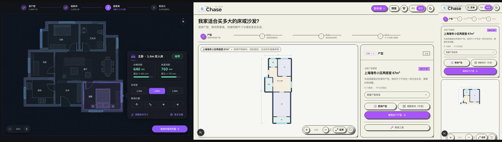

# /floor-plan Design QA

Status: **Passed**

## Visual comparison

From left to right: the earlier generated result-first reference, the final desktop implementation, and the final mobile implementation.

The generated image was used as a hierarchy reference for the compact recommendation controls. The user-selected direction is a guided four-step wizard, so the implementation intentionally does not reproduce the reference as a single canvas-first screen.

## What was verified

- The primary journey is explicit and sequential: floor plan → room → furniture → recommendation.
- Room-dimension adjustment is a secondary optional action, not a required step.
- The default interface no longer exposes the full editor toolbar, catalog, rules, and detailed inspector at once.
- The recommendation step leads with suitability, suggested widths, and 100 mm position nudges; full spatial checks remain available on demand.
- Desktop keeps the plan visible beside a compact task panel.
- Mobile puts the active task before the canvas, resets scroll position when the step changes, and has no horizontal overflow at 390 px.
- Returning to an earlier step shows the correct current step number.
- Existing advanced editing capabilities remain reachable from optional details and advanced tools.

## Iterations completed during QA

1. Hid the editor toolbar from the primary journey.
2. Moved the mobile task panel before the canvas.
3. Compressed the room grid and step headers so the primary action stays visible.
4. Removed a mobile stepper overflow at 390 px.
5. Prevented automatic expansion of the detailed furniture inspector.
6. Reset the mobile viewport to the top of the workflow after each step transition.
7. Corrected the desktop current-step counter after revisiting an earlier step.

## Functional verification

- Selected the Shanghai two-bedroom plan, chose the primary bedroom, added a double bed, and reached a suitable recommendation.
- Changed the bed width from 1.8 m to 1.5 m and confirmed the result updated immediately.
- Nudged the furniture position and confirmed the action completed without an error.
- Opened the optional room-adjustment action and confirmed it routes to structural controls.
- Relevant unit/component tests: 66 passed.
- ESLint on changed production files: passed.

## Known unrelated repository issue

The production build reaches type checking but is currently blocked by the pre-existing missing `StandardFloorPlan` type in `docs/china-representative-floor-plans/standard-floorplans-50.ts`.
